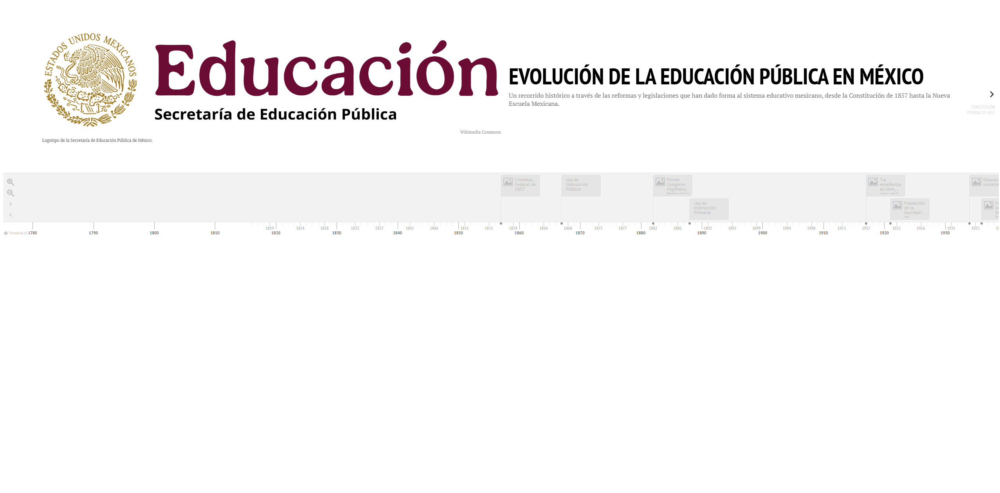

# Timeline Builder

Línea de tiempo sobre el derecho a la educación en México, construida con Timeline.js, esta línea de tiempo muestra antecedentes constitucionales que abarcan desde la Constitución de 1857 hasta la actualidad, destacando los años 1857, 1917, 1934, 1946, 1980, 1992 y 1993.

Este proyecto esta basado en el repositorio de [timeline-builder](https://github.com/Digital-Humanities-Toolkit/timeline-builder)

Constuido con un JSON de ejemplo y JS. [documentación](https://timeline.knightlab.com/docs/json-format.html)

Ver este ejemplo de [línea de tiempo](https://oscartinajero117.github.io/timeline-builder/)

